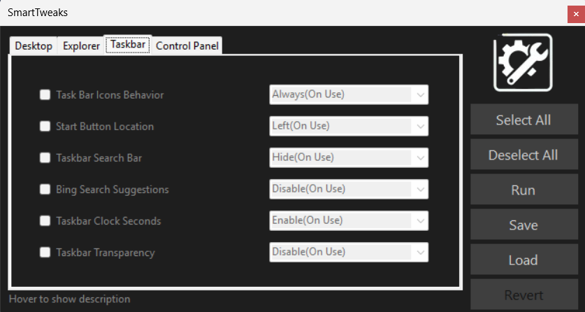

# SmartTweaks for Windows 11

**SmartTweaks** is a portable utility for Windows 11 that enables users to apply  system configurations via a centralized and simple interface. It eliminates the need to manually navigate the Registry Editor for common system tweaks.

---

## 🌐 Overview

* Categorized interface: Desktop, Explorer, Taskbar, Control Panel.
* Tweaks are applied using dynamically generated PowerShell scripts.
* No installation required, and no need for administrative privileges.
* Option to export settings as reusable `.ps1` scripts.

---

## ⚙️ Features

* Create the 'This computer' icon on Desktop
* Switch between the old and new context menu called by the right-click
* Display the name or the full path to the folder the explorer is currently on
* Choose if you want to show hidden folders and files on Explorer
* Choose between showing or hiding files extension
* Choose the spacing between itens on Explorer
* Highlight compressed and encrypted files
* Chooses when equal taskbar icons will combine
* Selects where the Start Button will be located
* Choose in which path will Explorer start
* Selects the behavior for the Search option on taskbar
* Selects how icons will be shown on Control Panel
* Select the size of each Control Panel icon (Work only on Icons)
* Switch between light and dark mode for Windows
* Disables or enables web search suggestions from Bing
* Enables or disables the display of seconds in the system clock on the taskbar
* Enables or disables transparency for the taskbar and other Windows elements
* Disables window minimize/maximize animations (Requires system restart)

---

## ❓ Usage

1. Launch `SmartTweaks.exe` **WITHOUT ADMINISTRATOR PRIVILEGES**.
2. Navigate through the available tabs (Desktop, Explorer, Taskbar, ControlPanel).
3. Select your desired configuration options.
4. Click **Run** to apply immediately.
5. Alternatively, click **Save** to export the settings as a PowerShell script.

> ⚡ Most settings require the Explorer process to be restarted for changes to take effect.

---

## 🔧 Requirements

* Windows 11 (Build 22000 or later)
* PowerShell 5.1 or later (pre-installed on Windows 11)

---

## 🔗 Download

Precompiled portable versions are available under the [Releases](https://github.com/your-user/smarttweaks/releases) section.

---

## 📄 License

Distributed under the [GNU General Public License v3.0](LICENSE).

---

## 🧱 Contributing

Contributions are welcome! Whether it’s new registry tweaks, improvements to the interface, or code optimizations:

1. Fork this repository
2. Create a new branch: `git checkout -b my-feature`
3. Submit a pull request with a clear description of your changes

---

## 🔍 Preview

---

For additional technical details or support, open an issue.
